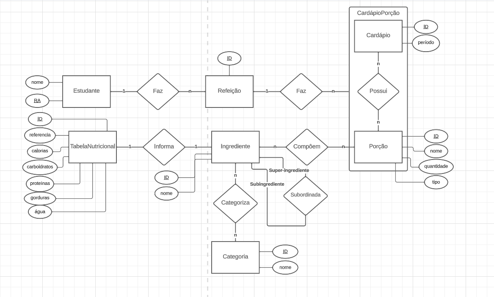
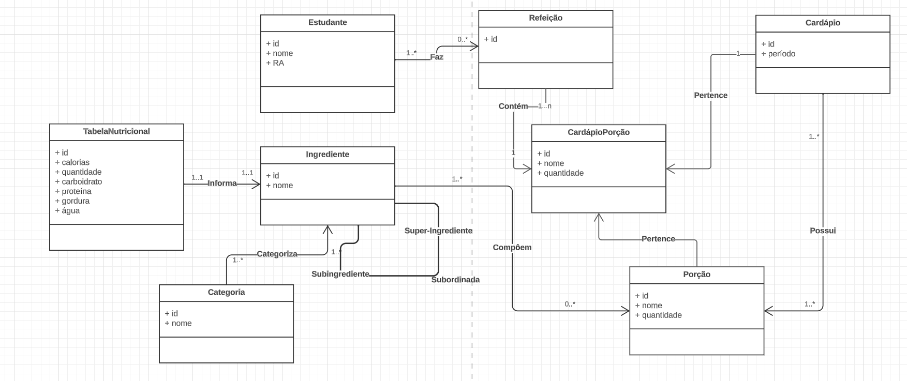

# Apresentação do Lab02 - Modelagem Conceitual de Refeições em um Restaurante

# Equipe `Sexteto Sinistro`

# Subgrupo `LGPD`
* `Gustavo Ferreira Gitzel` - `223559`
* `Maria Eduarda Elias Rocha` - `248408`
* `Pedro Sanchez Bitencourt` - `231133`

## Modelo Conceitual ER

# Modelo Conceitual UML

  