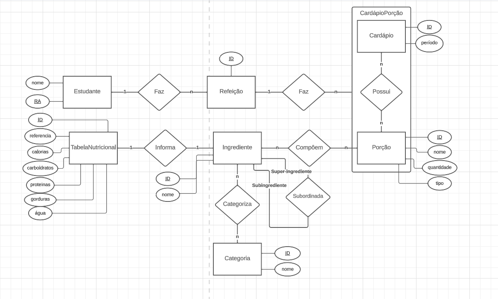

# Equipe `Sexteto Sinistro`

# Subgrupo `LGPD`
* `Gustavo Ferreira Gitzel` - `223559`
* `Maria Eduarda Elias Rocha` - `248408`
* `Pedro Sanchez Bitencourt` - `231133`

## Modelo Conceitual ER Revisado

# Mapeamento para o Modelo Relacional

~~~
ESTUDANTE(_ra_, nome)

TABELA_NUTRICIONAL(_id_, referencia, calorias, carboidratos, proteinas, gorduras, agua)

CATEGORIA(_id_, nome)

CATEGORIA_INGREDIENTE(_id_, id_categoria, id_ingrediente)
    id_categoria chave estrangeira -> CATEGORIA(id)
    id_ingrediente chave estrangeira -> INGREDIENTE(id)

INGREDIENTE(_id_, nome, id_tabela_nutricional, id_subingrediente)
    id_tabela_nutricional chave estrangeira -> TABELA_NUTRICIONAL(id)

SUBINGREDIENTE(_id_, id_super_ingrediente, id_sub_ingrediente)
    id_super_ingrediente chave estrangeira -> INGREDIENTE(id)
    id_sub_ingrediente chave estrangeira -> INGREDIENTE(id)
   
PORCAO(_id_, nome, quantidade, tipo)

CARDAPIO(_id_, periodo)

CARDAPIO_PORCAO(_id_, id_cardapio, id_porcao)
    id_cardapio chave estrangeira -> CARDAPIO(id)
    id_porcao chave estrangeira -> PORCAO(id)

REFEICAO_CARDAPIO_PORCAO(_id_, id_refeicao, id_cardapio_porcao)
    id_refeicao chave estrangeira -> CARDAPIO(id)
    id_cardapio_porcao chave estrangeira -> CARDAPIO_PORCAO(id)

REFEICAO(_id_, ra, id_refeicao_cardapio_porcao)
    id_refeicao_cardapio_porcao chave estrangeira -> REFEICAO_CARDAPIO_PORCAO(id, id_refeicao, id_cardapio_porcao)
(id)
~~~