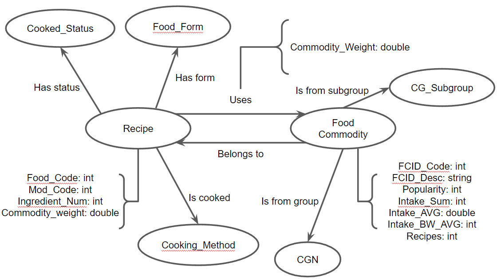

# Modelo para Apresentação do Lab07 - Modelo Lógico para Banco de Dados de Grafos

# Equipe `Sexteto Sinistro`

# Subgrupo `LGPD`
* `Gustavo Ferreira Gitzel` - `223559`
* `Maria Eduarda Elias Rocha` - `248408`
* `Pedro Sanchez Bitencourt` - `231133`

## Modelo Lógico do Banco de Dados de Grafos
> 

## Perguntas de Pesquisa/Análise

> Liste aqui as três perguntas de pesquisa/análise
> * Quais são as commodities mais populares (com base na propriedade Popularidade) e quais receitas as utilizam? Para ajudar a identificar ingredientes comuns em receitas populares
> * Qual é a ingestão média (Intake_AVG) das commodities usadas em uma receita específica? Para entender o impacto nutricional de uma receita
> * Quais commodities são usadas no maior número de receitas (com base na propriedade Receitas)? Para identificar ingredientes básicos.

