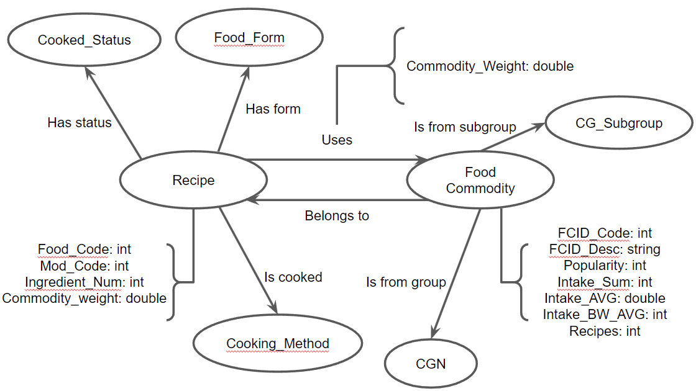

# Modelo para Apresentação do Lab08 - Modelo Lógico e Análise de Dados em Grafos

# Equipe `Sexteto Sinistro`

# Subgrupo `LGPD`
* `Gustavo Ferreira Gitzel` - `223559`
* `Maria Eduarda Elias Rocha` - `248408`
* `Pedro Sanchez Bitencourt` - `231133`

## Modelo Lógico do Banco de Dados de Grafos

> 

## Perguntas de Pesquisa/Análise Combinadas e Respectivas Análises

### Pergunta/Análise 1
> * Quais são as commodities mais populares (com base no atributo Popularity) e quais receitas as utilizam? Para ajudar a identificar ingredientes comuns em receitas populares
>   * Usando a centralidade podemos perceber analisando pela propriedade Popularity e a relação Belongs To com a Recipe quais commodities tem maior popularidade

### Pergunta/Análise 2
> * Quais são as commodities cuja remoção teria o maior impacto no número de receitas possíveis?
>   * Usando a vulnerabilidade pode-se calcular analisando cada nó do tipo Food_Commodity e com quantas Recipes cada um se relaciona e perceber qual dos nós seria mais prejudicial ao grafo ao ser removido. 

### Pergunta/Análise 3
> * Quais receitas são prováveis de começar a usar uma nova commodity com base em suas relações existentes?
>   * TODO